## Introduction

Hi everyone. Today we are going to learn more about password storage.

If you are just starting to code and don't know what actually happens when an application stores a user's password, don't worry. We will start from the basics and slowly move toward how a production-grade password hashing system works.

As developers, it's our responsibility to build solutions that are not only working but also safe for the people who use them.

Let's suppose you are building an application and have a registration form:

```text
Email: noor@example.com
Password: NoorsPassword123
```

The user clicks **Register**.

Now what do we do with that password?

Do we simply put it inside the database?

Obviously, no.

But why?

That's what we are going to understand in this guide.

---

## Why password storage is still a common security failure

When a new user registers on a platform, they provide credentials such as an email and password. The application needs to store enough information to verify that password later.

At first, everything looks fine.

But now suppose we store the password directly in the database:

```text
email: noor@example.com
password: NoorsPassword123
```

Now imagine that an attacker gets access to the database.

The attacker doesn't need to crack anything.

They can simply read the password.

It becomes even worse because people often reuse passwords.

Let's say I register on 10 different applications and, because I don't want to remember 10 different passwords, I use the same password everywhere.

If one of those applications stores my password in plain text and gets compromised, an attacker can take that password and try it on my other accounts.

One compromised application can therefore become the starting point for compromising accounts somewhere else.

This is one of the reasons we **hash passwords before storing them**.

But hashing is not the same thing as encryption.

Let's understand that first.

---

## What this guide covers

In this guide we are going to start with the basic problem and gradually move toward a production-grade password hashing design.

We will discuss:

- What hashing actually is
- Why encryption isn't the right solution for passwords
- Why MD5, SHA-1 and SHA-256 aren't suitable for password storage
- Salts and peppers
- Memory-hard password hashing
- bcrypt, scrypt, PBKDF2 and Argon2
- Why Argon2id is a strong choice for modern applications
- How a production password hasher works
- PHC strings
- Choosing parameters
- `needsRehash`
- Timing attacks
- Pepper management
- Legacy password migration
- Testing
- Production considerations

We are deliberately not going to build a complete authentication system here. Things like sessions, OAuth, MFA and authorization are separate topics.

The goal here is specifically to understand **how to safely store and verify passwords**.

For practical security guidance, OWASP's [Password Storage Cheat Sheet](https://cheatsheetseries.owasp.org/cheatsheets/Password_Storage_Cheat_Sheet.html) is an excellent reference.

---

## The Core Problem

Before talking about algorithms, let's understand the actual problem we are trying to solve.

Suppose an attacker gets a copy of your database.

You might think:

> "If the database is compromised, we are already screwed. Why does password hashing matter?"

That's a fair question.

If your database contains user information, the attacker may already have access to a lot of things.

But password hashing gives us an important layer of protection.

Imagine the database contains:

```text
email: noor@example.com
password: NoorsPassword123
```

The attacker immediately knows the password.

Now imagine the database contains:

```text
email: noor@example.com
password_hash: $argon2id$v=19$m=...
```

The attacker doesn't immediately know the password.

Now they have another problem.

They need to **crack the password**.

And this is the real goal of password hashing:

> We want to make recovering the original password from a stolen password database as expensive and difficult as reasonably possible.

Notice that I said **expensive**.

We aren't trying to make cracking mathematically impossible.

Passwords are usually created by humans, and humans are not very good at creating random secrets.

The goal is to make every password guess expensive enough that large-scale **offline cracking** becomes difficult.

### What is offline cracking?

Offline cracking means the attacker already has the password hashes and can perform guesses on their own computer without talking to your application.

For example:

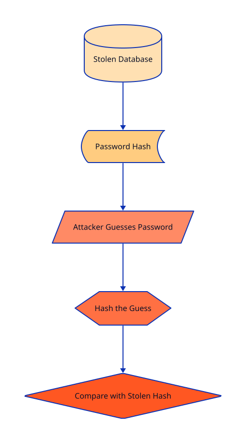

Your server isn't there to stop them.

This is why password hashing matters so much.

---

## Why Not Just Encrypt Passwords?

You might think:

> "Why don't we encrypt the password before storing it?"

Encryption is designed to be reversible.

For example:

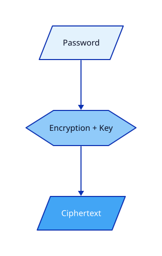

And later:

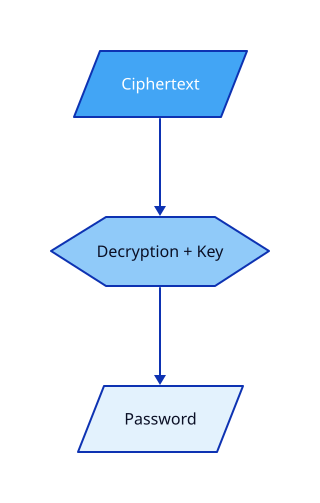

**Ciphertext** simply means the encrypted form of the original data.

The problem is that your application doesn't need to know the user's original password.

When a user logs in, we don't need to decrypt their password.

We only need to answer one question:

> "Does the password this user entered match the password they created when they registered?"

This is where hashing fits.

---

## Hashing vs Encryption

Hashing is designed as a one-way transformation:

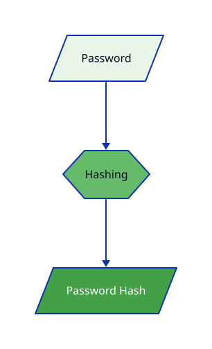

There isn't a normal "decrypt" operation that gives you the original password back.

Encryption is different:

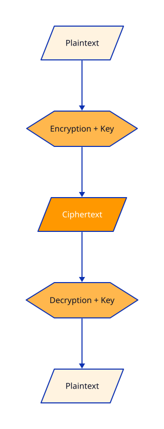

**Plaintext** simply means the original readable data before encryption.

So remember this:

> **If you need to recover the original data, encryption may be appropriate. If you only need to verify something, hashing is usually the right tool.**

Passwords fall into the second category.

---

## Why Fast Hashes Fail

Now you might think:

> "Okay, I understand hashing. Let's just use SHA-256."

SHA-256 is a great cryptographic hash function.

But that is exactly the problem.

It is **too fast** for password hashing.

Let's say an attacker gets our database.

They can take a password guess:

```text
password123
```

and calculate:

```text
SHA-256("password123")
```

Then they compare the result with the stolen hash.

If it doesn't match, they try another password:

```text
password123
123456789
qwerty123
letmein
...
```

The faster they can calculate hashes, the more guesses they can make.

Modern hardware is extremely good at performing huge numbers of simple hash operations in parallel.

Attackers can also use GPUs and specialized hardware to perform large numbers of guesses.

This is why general-purpose cryptographic hashes such as:

- MD5
- SHA-1
- SHA-256

should not be used directly for storing passwords.

They were designed to be **fast**.

For passwords, we actually want the opposite.

We want password hashing to be deliberately expensive.

---

## The Building Blocks of Modern Password Hashing

Modern password hashing doesn't simply mean:

```text
hash(password)
```

There are several important building blocks involved.

The most important ones are:

- Salt
- Pepper
- Memory hardness
- Work factor

Let's start with salt.

---

### Salt

A **salt** is a random value generated for each password.

Suppose two users choose the same password:

```text
User A → hello123
User B → hello123
```

If we simply hash the password:

```text
hash("hello123")
```

both users would get the same hash.

That's not ideal.

Instead, we generate a different salt for every password.

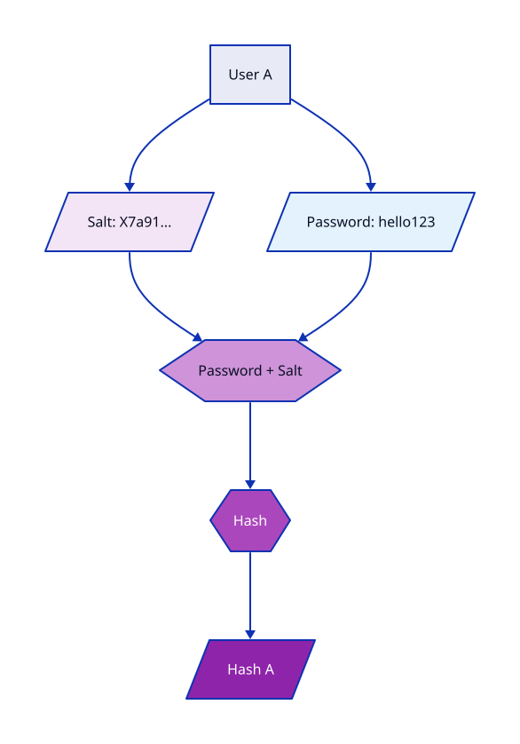

And:


Now the hashes are different even though the passwords are identical.

So:

> **Same password + different salt = different password hash.**

#### Does the salt need to be secret?

No.

This is something beginners sometimes find confusing.

The salt is not a password.

It is not an encryption key.

It is completely fine to store the salt alongside the password hash.

For example:

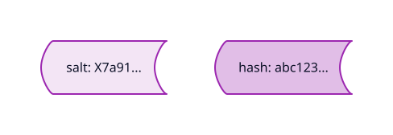

The security comes from the fact that the attacker still has to perform the expensive password hashing process for each guess.

#### What does the salt protect us from?

One important thing salts help prevent is **pre-computation**.

Pre-computation means an attacker calculates the hashes of many common passwords ahead of time and stores the results.

For example:

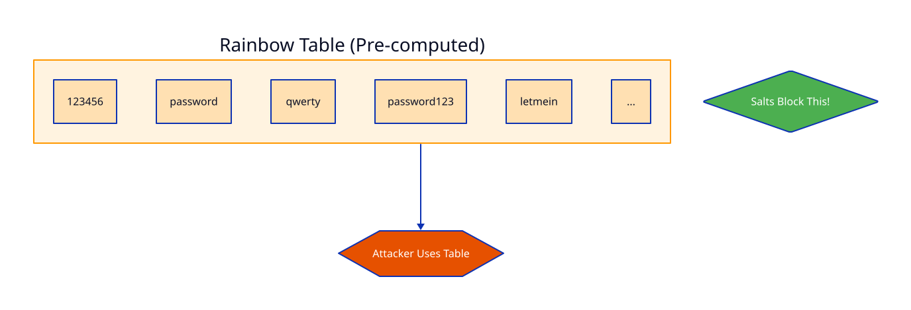

The attacker could build a huge lookup table.

This is one of the ideas behind **rainbow-table attacks**.

A rainbow table is essentially a precomputed set of password-hash relationships used to speed up password recovery.

With unique salts, the attacker can't simply calculate one hash for `password123` and use it against every account.

They need to perform the computation again for each different salt.

So the salt doesn't make a weak password strong.

It makes large-scale pre-computation much less useful.

---

## Pepper

Now let's introduce another concept: the **pepper**.

A pepper is a secret value shared by the application rather than generated separately for every password.

This makes it different from a salt.

A salt is:

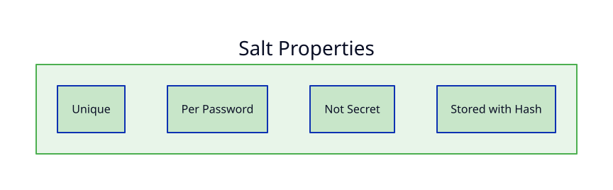

A pepper is:

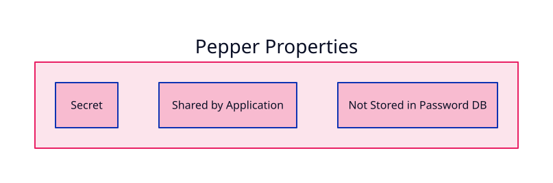

Why would we want this?

Imagine an attacker steals your entire password database.

They have:

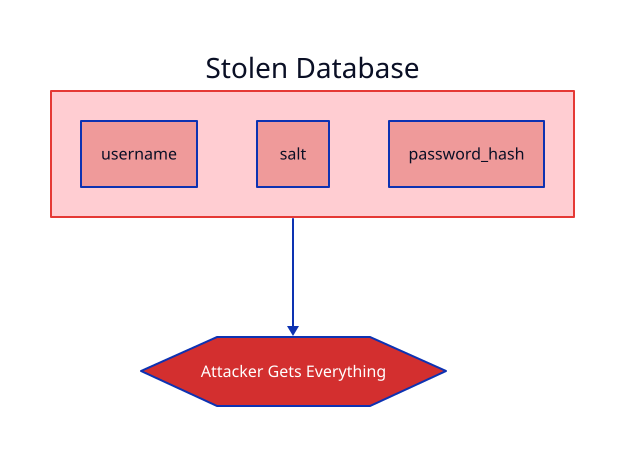

But they don't have the pepper.

Now the attacker does not have the additional secret used by your password hashing design.

A common construction is to use the pepper through **HMAC**.

HMAC stands for **Hash-based Message Authentication Code**. It is a construction that combines a cryptographic hash function with a secret key.

For example:

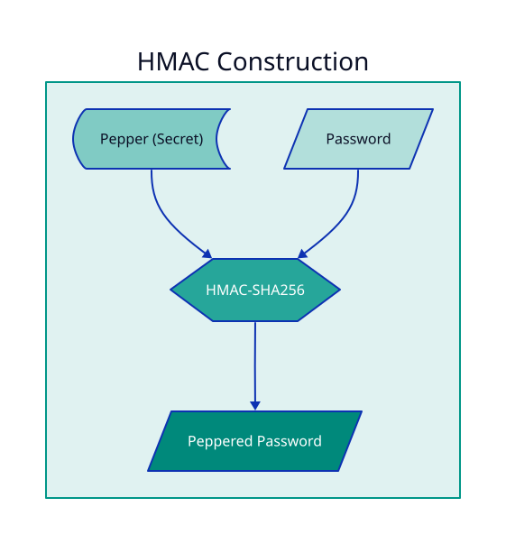

The important point isn't that HMAC magically makes passwords secure.

The point is that we are introducing another secret that is stored **outside the database**.

### Where should the pepper live?

The pepper should live in a proper secret-management system or protected application configuration.

It should **not** be stored in the same database as the password hashes.

If you do this:

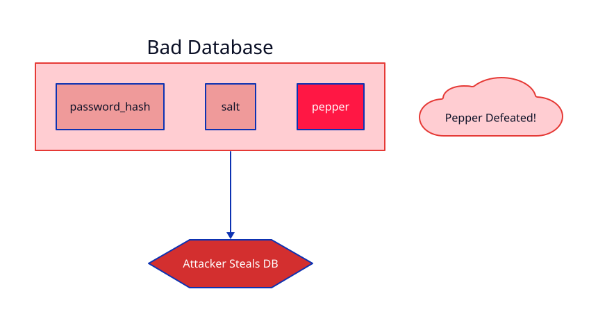

then an attacker who steals the database gets both.

You have defeated much of the reason for having a pepper.

---

## Memory-Hard Password Hashing

Now let's talk about one of the most important properties of modern password hashing.

**Memory hardness.**

An attacker doesn't only have CPUs.

They can use GPUs and other hardware designed to perform huge amounts of computation in parallel.

So instead of only making password hashing computationally expensive, modern password-hashing algorithms can also require significant amounts of memory.

For example, instead of:

```text
Hash(password)
```

we can configure a password-hashing algorithm to require:

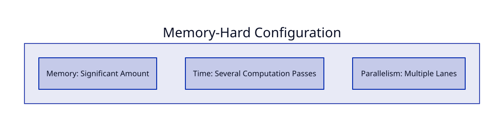

The exact numbers depend on your environment.

Why does memory matter?

Because attackers want to run many guesses at the same time.

If every guess requires a significant amount of memory, running thousands or millions of guesses in parallel becomes more expensive.

This is one of the reasons Argon2 is interesting for password storage.

---

## The Password Hashing Algorithms

There are several password-hashing algorithms you will encounter.

### PBKDF2

PBKDF2 stands for **Password-Based Key Derivation Function 2**.

It is an established password-based key derivation function and is still widely used.

It is not simply "broken."

However, compared with newer memory-hard designs, PBKDF2 does not provide the same memory-hard properties.

If you are designing a new system and have a choice, a modern memory-hard password hashing algorithm is worth considering.

---

### bcrypt

bcrypt has been around for a long time and is still commonly used.

It is much better suited for password storage than MD5 or SHA-256.

It has an adjustable **cost factor**, which controls how much computation is required.

As hardware becomes faster, the cost can be increased.

But bcrypt also has limitations, including a relatively small maximum password input size and the fact that it isn't memory-hard in the same way as Argon2 or scrypt.

So bcrypt isn't "bad."

It is simply an older choice with limitations.

---

### scrypt

scrypt was designed to make password cracking more expensive by requiring both computation and memory.

This makes it much more suitable for password storage than a normal fast cryptographic hash.

It is still a valid password hashing choice.

But when building a new system today, Argon2id is often the more attractive choice.

---

## Argon2

Now we reach Argon2.

Argon2 won the **Password Hashing Competition**, a competition created to identify better password hashing algorithms.

There are three main variants:

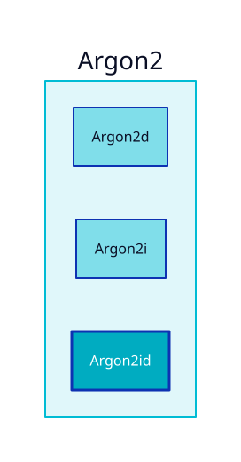

You don't need to memorize all the internal details right now.

The important thing is that they have different security and side-channel characteristics.

A **side-channel attack** is an attack that learns information by observing indirect behavior such as timing, memory access patterns, power consumption or other measurable effects rather than simply attacking the algorithm directly.

For general password storage, **Argon2id is generally the recommended variant**.

So if you are building a new application, a reasonable choice is:

```text
Argon2id
```

But don't stop there.

Choosing the algorithm is only part of the problem.

You still need to choose the parameters.

---

## How a Production-Grade System Works

Now let's put all these pieces together.

A simplified registration flow looks like this:

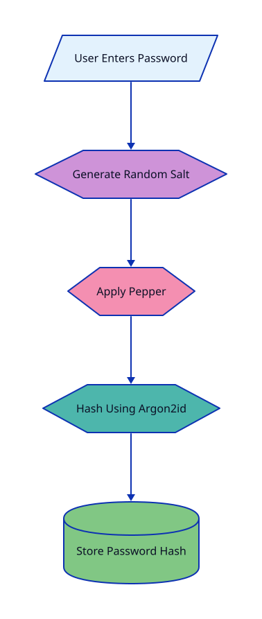

Let's make it more concrete.

### Step 1: User gives us a password

```text
NoorsPassword123
```

### Step 2: Generate a unique salt

For example:

```text
salt = random 128-bit value
```

The salt should come from a **cryptographically secure random number generator**.

That means a random generator designed specifically for security-sensitive values rather than a normal pseudo-random function intended for games or general application logic.

### Step 3: Apply the pepper

One possible construction is:

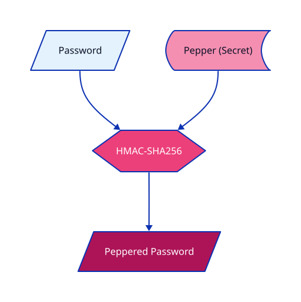

Now we have a value that depends on:

```text
password + secret pepper
```

### Step 4: Hash with Argon2id

Now we run Argon2id with our chosen parameters:

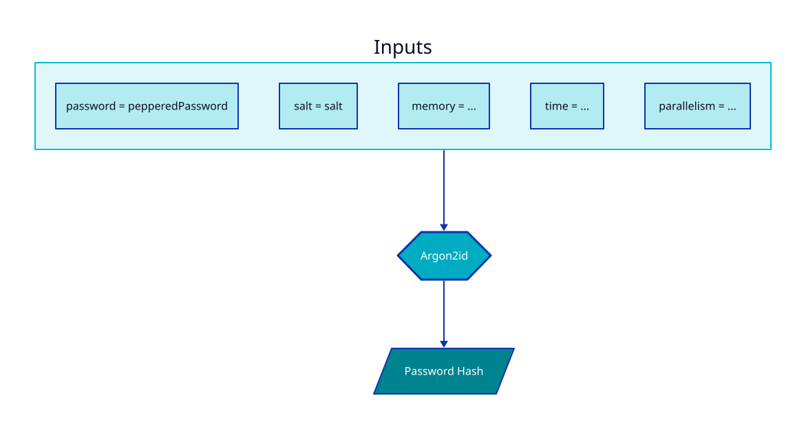

The result is our password hash.

### Step 5: Store the result

We don't need to store the plaintext password.

We store the information needed to verify it later.

A **PHC string** can contain the algorithm, version, parameters, salt and hash.

For example:

```text
$argon2id$v=19$m=65536,t=3,p=4$...$...
```

Now let's understand what that strange string actually means.

---

## The PHC String Format

When you first see this:

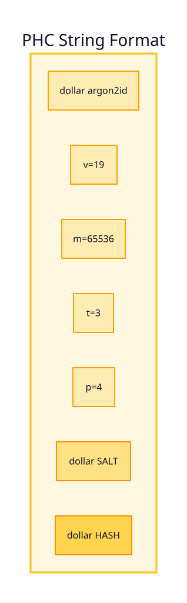

you might think:

> "What the hell is this?"

It's actually useful.

The string contains information about how the password was hashed.

For example:

```text
$argon2id
```

tells us the algorithm.

```text
v=19
```

tells us the Argon2 version.

```text
m=65536
```

is the memory cost.

```text
t=3
```

is the time cost.

```text
p=4
```

is the degree of parallelism.

**Parallelism** controls how many independent computation lanes the algorithm can use.

Then we have:

```text
$SALT
```

and:

```text
$HASH
```

This is useful because the verifier doesn't have to guess which parameters were used.

The hash itself tells the password-hashing library how the password should be verified.

This also becomes extremely useful when you increase your security parameters later.

---

## Parameter Selection and Operational Reality

Now comes one of the most important parts.

You will find recommendations online such as:

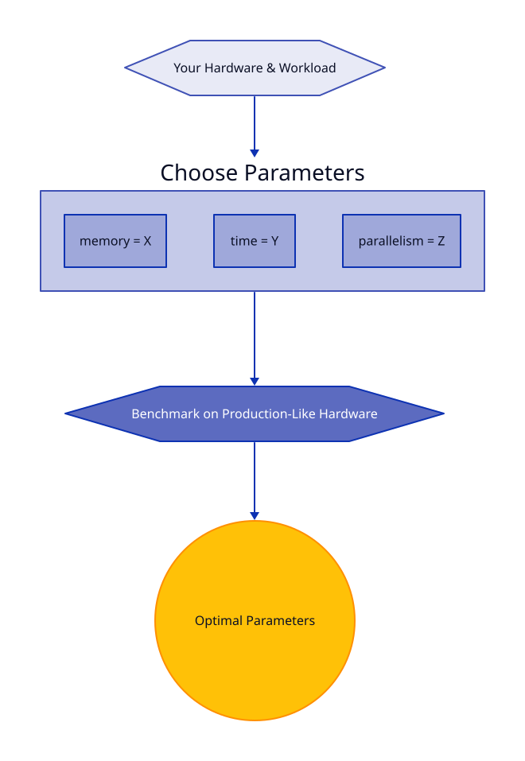

You might be tempted to copy them and move on.

Don't.

Your server is not my server.

Your application is not my application.

Your traffic isn't my traffic.

The correct parameters depend on your hardware and application's workload.

The general idea is:

> Make password hashing expensive enough to slow attackers down, but not so expensive that your own application becomes unusable.

You should measure this on your actual production-like hardware.

Suppose your password hashing takes:

```text
50 ms
```

That's one thing.

If it takes:

```text
2 seconds
```

that's a completely different operational problem.

Now imagine 100 users trying to log in at the same time.

If each operation consumes a significant amount of memory, your total memory usage can become very large.

So don't only think:

```text
How expensive is one password hash?
```

Also think:

```text
How expensive are 100 concurrent password hashes?
```

This is why parameter selection is both a **security problem and an operational problem**.

Use established guidance such as OWASP's recommendations as a baseline, then benchmark and adjust for your environment.

---

## Security Properties and Defenses

Password hashing is not just about choosing Argon2id.

There are other problems we need to think about.

### Timing attacks

Suppose your login endpoint behaves differently depending on whether a user exists.

For example:

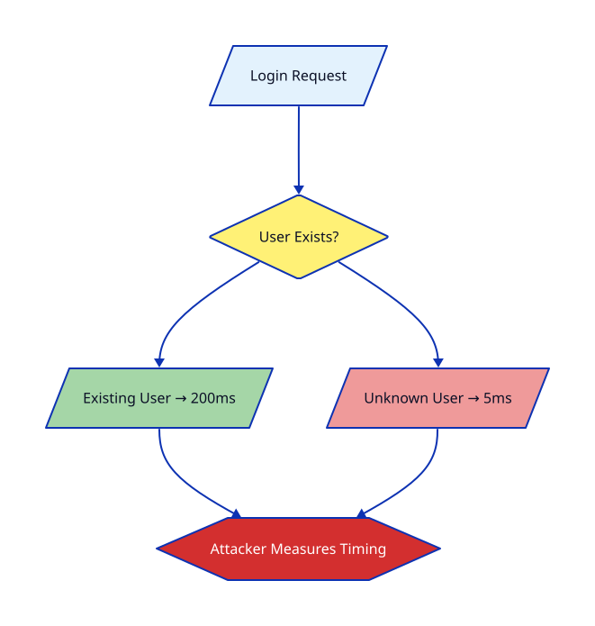

An attacker could potentially use this timing difference to determine which email addresses are registered.

A **timing attack** is an attack where someone learns information by measuring how long an operation takes.

One technique for reducing this difference is to perform a dummy password hash when the user doesn't exist.

Conceptually:

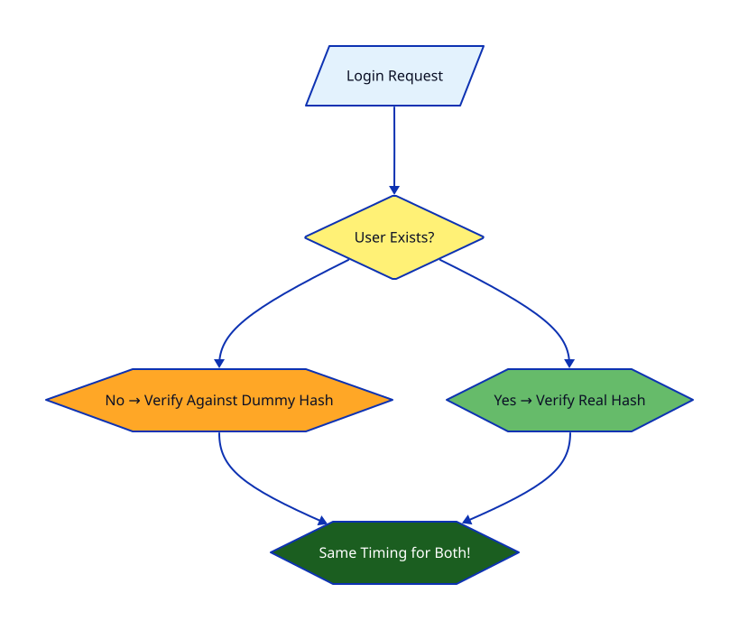

The goal is to make the expensive part of the operation happen in both cases.

This isn't the only thing you need for secure authentication, but it can reduce information leakage.

---

### Downgrade protection

Suppose your application expects Argon2id.

An attacker shouldn't be able to send some random bcrypt or malformed hash and convince your system to use a weaker verification path.

Your password verifier should know what formats it accepts.

For example:

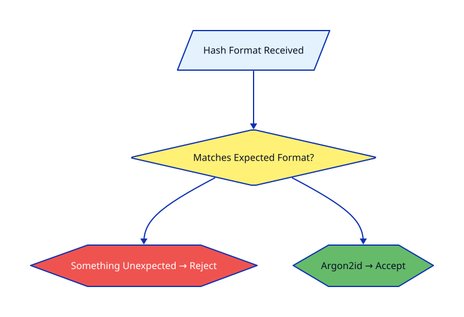

The application should reject it rather than blindly trusting whatever format appears in the database.

This becomes particularly important during migrations when you intentionally support multiple legacy formats.

---

### Limit password input length

Passwords can be extremely long.

Your application should have sensible limits.

But be careful here.

When talking about limits, think about **bytes**, not just characters.

Some characters can take multiple bytes when encoded as UTF-8.

So:

```text
characters != bytes
```

Your password handling code should have a deliberate policy rather than accidentally allowing unlimited input.

---

### Fail-fast configuration validation

Imagine your application starts with:

```text
ARGON_MEMORY_COST=
ARGON_TIME_COST=
PASSWORD_PEPPER=
```

and those values are missing.

You don't want your application to quietly start with some unsafe fallback configuration.

It's better to validate security-critical configuration when the application starts.

If something required is missing or invalid:

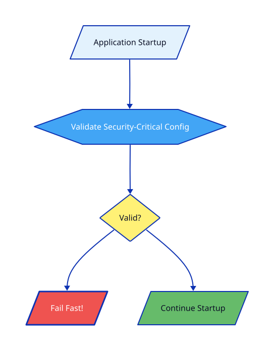

This is much better than discovering the problem when the first user tries to log in.

---

## The Login Upgrade Pattern

Let's say you initially deployed your application with:

```text
memory = 64 MB
time = 3
parallelism = 4
```

A year later, your infrastructure is faster.

You decide to increase the parameters.

Now you have a problem.

You have thousands of users whose passwords were already hashed using the old parameters.

Should you force everyone to reset their password?

Not necessarily.

There is a better approach.

When the user successfully logs in:

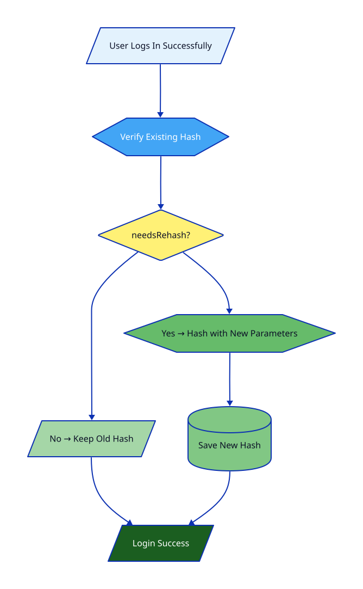

This allows you to gradually strengthen your password hashes as users log in.

You don't need to rehash every password immediately.

You don't even have the plaintext passwords needed to do that.

The user has to successfully authenticate first.

---

## Pepper Management in Practice

Pepper sounds simple:

```text
PASSWORD_PEPPER=some-secret
```

But now we have to think about secret management.

The pepper should be:

- Cryptographically random
- Long enough
- Stored outside the password database
- Protected using your secret-management infrastructure

And you should never log it.

For example, don't do this:

```text
console.log({
    password,
    pepper,
    hash
});
```

Obviously this example is terrible, but accidental logging of secrets happens more often than you might think.

### What happens when the pepper changes?

This is where things become complicated.

If you change:

```text
OLD_PEPPER
```

to:

```text
NEW_PEPPER
```

your existing password hashes were created using the old pepper.

You can't simply start verifying them using the new one.

One possible strategy is supporting both peppers during a controlled rotation period:

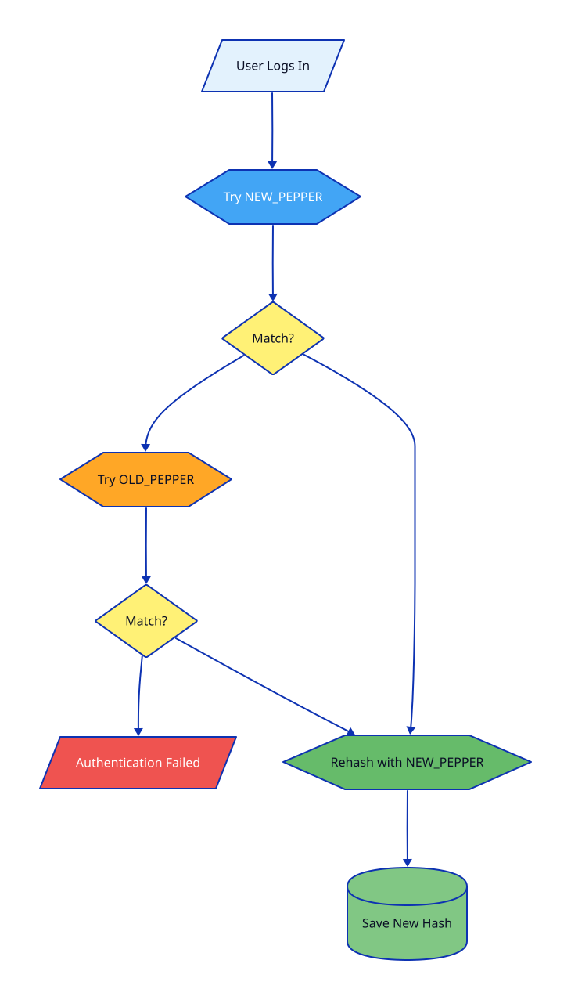

Then gradually move users to the new pepper.

The exact implementation depends on your architecture and threat model, so pepper rotation is something you should design deliberately rather than add casually.

---

## Common Mistakes

Let's quickly go through some mistakes developers commonly make.

### Mistake 1: Storing passwords using reversible encryption

```text
encrypt(password)
```

Don't do this when you only need to verify the password.

Use a password-hashing algorithm.

### Mistake 2: Using the same salt for every user

Don't do:

```text
SALT = "my-super-salt"
```

and use it everywhere.

Generate a unique cryptographically secure salt for each password.

### Mistake 3: Storing the pepper in the database

If your database contains:

```text
password_hash
salt
pepper
```

then the attacker gets everything together.

Keep the pepper outside the database.

### Mistake 4: Never upgrading old hashes

If you increase your Argon2id parameters but never rehash existing passwords, your old users remain protected by the old parameters forever.

Implement the:

```text
verify → needsRehash → rehash → save
```

pattern.

### Mistake 5: Leaking whether a user exists

Be careful with timing and error responses.

Don't accidentally build an endpoint where:

```text
"User doesn't exist"
```

and:

```text
"Password is incorrect"
```

have dramatically different behavior.

### Mistake 6: Accepting random hash formats

Your password verifier shouldn't blindly trust whatever algorithm or format appears in the database.

Know what formats your application supports.

### Mistake 7: Thinking password hashing solves authentication

It doesn't.

You still need to think about:

- Rate limiting
- Session security
- MFA
- Credential stuffing
- Account recovery
- Authorization
- Secure cookies
- HTTPS
- CSRF where applicable
- Secret management

Password hashing solves **one specific problem**:

> How do we store passwords so that a stolen password database is much harder to turn into usable passwords?

For a broader view of authentication threats and defenses, OWASP's [Authentication Cheat Sheet](https://cheatsheetseries.owasp.org/cheatsheets/Authentication_Cheat_Sheet.html) is worth reading.

---

## Migrating from Legacy Systems

Now imagine you have an old application.

Maybe it currently stores:

```text
SHA-256(password)
```

and you want to move to Argon2id.

You can't simply take the SHA-256 hash and put it into Argon2id as if it were the user's password.

You need a migration strategy.

A common approach is:

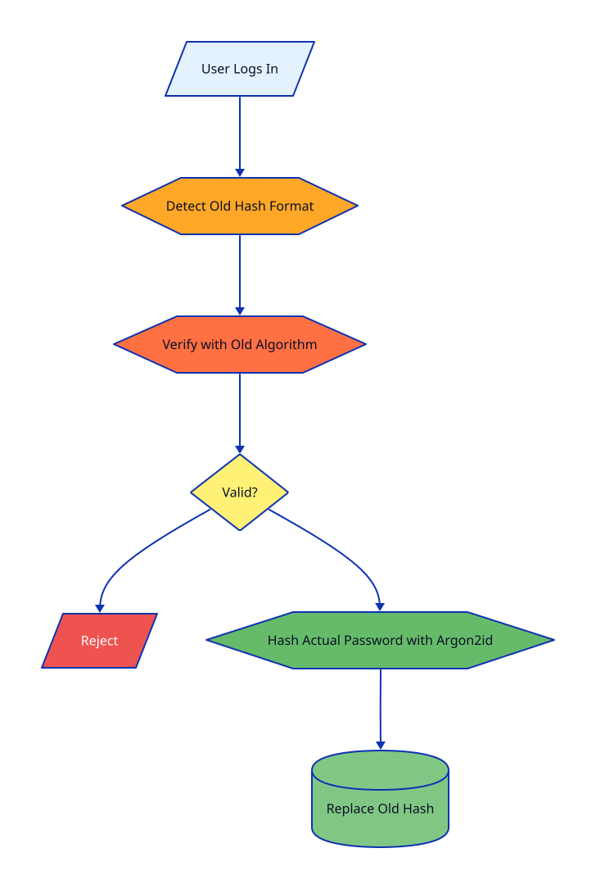

The important part is that you only upgrade the hash **after the user has successfully proved they know the password**.

You should not blindly take unverified legacy hashes and treat them as authenticated credentials.

---

## Testing and Development

Password hashing can be annoying to test because production parameters are intentionally expensive.

You don't want every unit test to spend a large amount of time hashing passwords.

So your tests can use deliberately weaker parameters.

For example:

```text
Production:
memory = high
time = high

Tests:
memory = low
time = low
```

The important thing is that your test configuration cannot accidentally become your production configuration.

You should test things like:

```text
password → hash → verify = true

wrong password → verify = false

different passwords → different hashes

same password + different salts → different hashes

needsRehash = true when parameters change

unsupported hash format → rejected

invalid configuration → startup failure
```

Don't only test the happy path.

Security code especially needs tests for things that should **fail**.

---

## Putting It All Together

At this point we can put the entire architecture together.

A simplified production design looks like this:

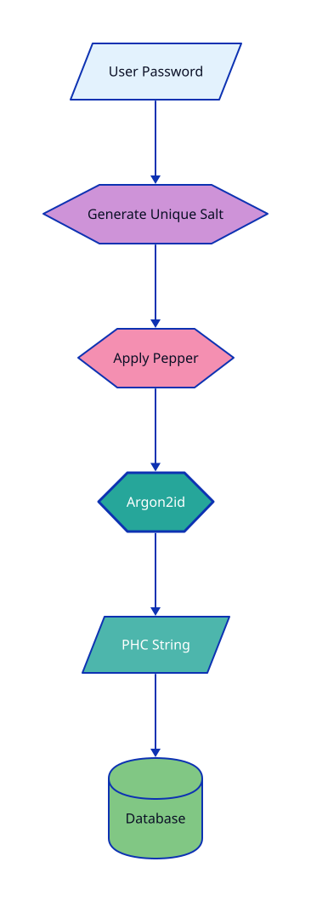

Then login:

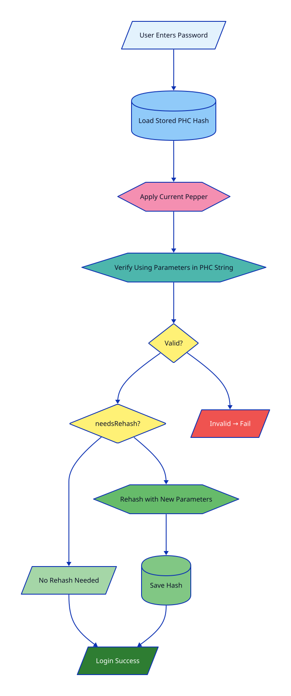

You should also have:

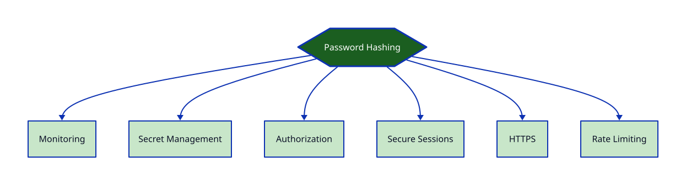

because password hashing is only one layer of your security architecture.

---

### One hasher configuration per application

In your application, password hashing configuration should generally be centralized.

Instead of every route doing something different:

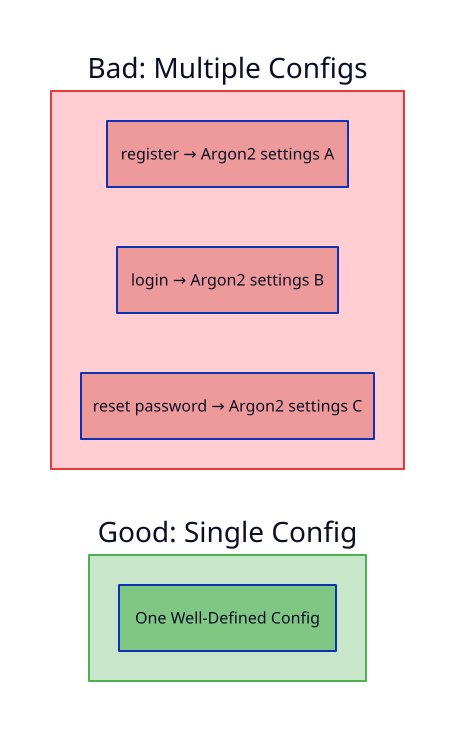

have one well-defined password hashing configuration.

This makes the behavior easier to reason about and prevents accidental inconsistencies.

---

### Don't log passwords

This should be obvious, but it is worth saying.

Never log:

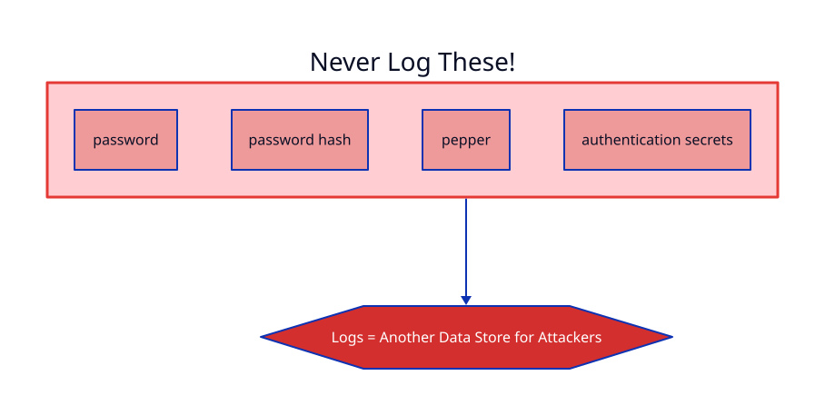

A log system is another data store.

If your application logs secrets, you have simply created another place for attackers to look.

---

## Production Checklist

Before calling your password storage system production-ready, ask yourself:

### Password hashing

- [ ] Are passwords hashed instead of encrypted?
- [ ] Are you using a dedicated password hashing algorithm?
- [ ] Are you using Argon2id or another appropriate modern choice?
- [ ] Are parameters based on real benchmarks?
- [ ] Is the work factor high enough for your environment?

### Salt

- [ ] Does every password get a unique random salt?
- [ ] Is the salt generated using a cryptographically secure RNG?
- [ ] Is the salt stored with the password hash?

### Pepper

- [ ] Is the pepper generated securely?
- [ ] Is it stored outside the database?
- [ ] Is it protected using proper secret management?
- [ ] Do you have a plan for rotation?

### Login

- [ ] Do you verify passwords using the stored parameters?
- [ ] Do you use `needsRehash` when appropriate?
- [ ] Do you rehash successful logins when parameters become outdated?
- [ ] Do you avoid obvious user-existence timing leaks?
- [ ] Do you rate-limit credential endpoints?

### Configuration

- [ ] Does the application validate security-critical configuration at startup?
- [ ] Can development/test settings accidentally reach production?
- [ ] Are password hashes and secrets excluded from logs?

### Migration

- [ ] Can you identify legacy password formats?
- [ ] Do you upgrade old hashes after successful authentication?
- [ ] Do you reject unsupported or malformed formats?

---

## Further Reading

If you want to go deeper into password hashing, don't stop at blog posts.

Read the actual standards and security guidance.

Useful places to continue:

- [OWASP Password Storage Cheat Sheet](https://cheatsheetseries.owasp.org/cheatsheets/Password_Storage_Cheat_Sheet.html)
- [OWASP Authentication Cheat Sheet](https://cheatsheetseries.owasp.org/cheatsheets/Authentication_Cheat_Sheet.html)
- [RFC 9106 — Argon2](https://www.rfc-editor.org/rfc/rfc9106)
- [Password Hashing Competition](https://www.password-hashing.net/)
- Documentation for your chosen Argon2 implementation
- Documentation for your secret-management system
- Research around credential stuffing and rate limiting

The important thing isn't to memorize every parameter or every algorithm.

You should understand **why** the system is designed this way.

A good password-storage system is basically trying to make this attack:

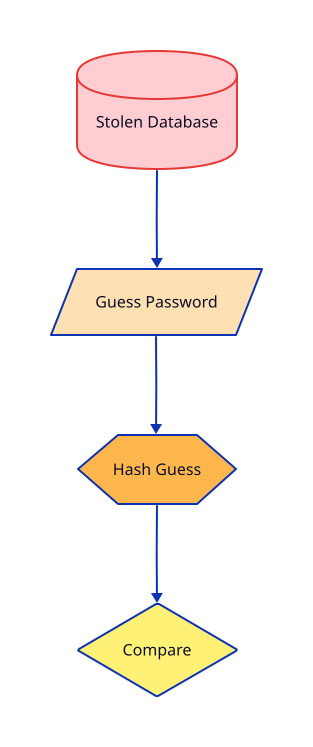

as expensive as possible for the attacker.

And that's the entire idea behind modern password hashing:

> **We can't stop an attacker from guessing passwords offline if they have our database. What we can do is make every guess expensive enough that large-scale cracking becomes much harder.**

---

## See the Implementation

If you want to see these ideas implemented as reusable production-oriented code, I built a password hashing block for **Blockend**.

It uses Argon2id with additional protections such as HMAC-SHA256 peppering, automatic salting, PHC-compatible hashes, and rehash detection.

**Blockend — Password Hashing**

https://blockend.noorulhassan.com/docs/02-blocks/10-password-hash

The goal isn't just to provide a function that hashes a password.

The goal is to make the security decisions explicit and give developers a reusable implementation they can actually understand and own.
